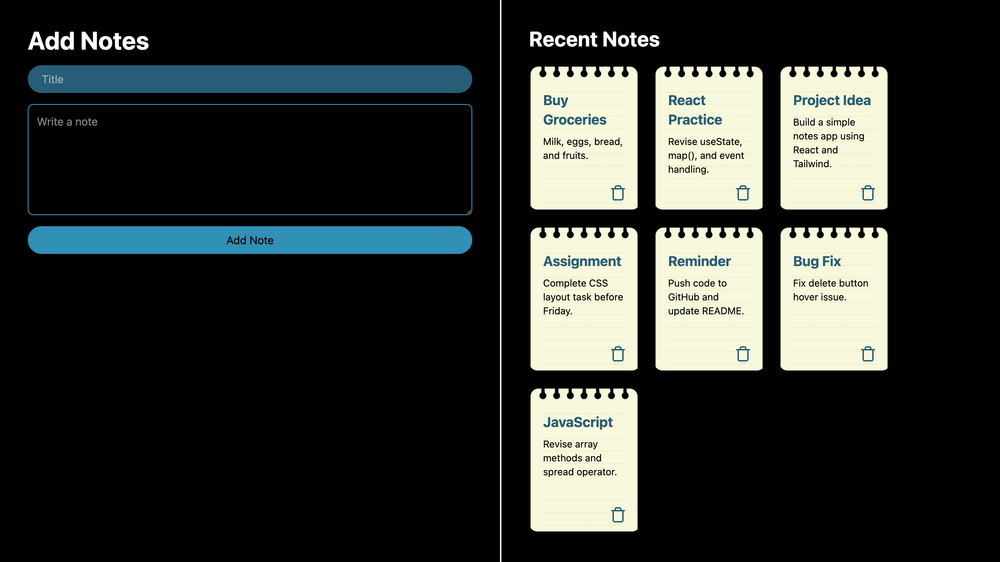

# Notes App – React Learning Project

This is a simple **Notes Application** built using **React** and **Tailwind CSS**. The purpose of this project is to understand and practice core React concepts such as state management, event handling, controlled components, and rendering lists dynamically.

This is a **learning project**, focused on clarity and fundamentals rather than production-level optimization.

---

## Features

* Add notes with a **title** and **details**
* Display notes instantly without page reload
* Delete individual notes
* Fully controlled form inputs
* Responsive layout (mobile + desktop)
* Styled using Tailwind CSS

---

## Tech Stack

* **React (useState hook)**
* **Tailwind CSS** for styling
* **lucide-react** for icons

---

## Project Structure

```
src/
 ├── App.jsx
 ├── main.jsx
 └── index.css
```

All logic is written inside `App.jsx` to keep the learning flow simple and readable.

---

## How the App Works

### 1. State Management

Three pieces of state are used:

```js
const [title, setTitle] = useState('')
const [detail, setDetail] = useState('')
const [task, setTask] = useState([])
```

* `title` → stores the note title
* `detail` → stores the note content
* `task` → stores an array of all notes

---

### 2. Adding a Note

When the form is submitted:

* Default page reload is prevented using `e.preventDefault()`
* A **copy of the existing task array** is created
* A new note object `{ title, detail }` is pushed
* State is updated using `setTask()`
* Input fields are cleared

```js
const copyTask = [...task]
copyTask.push({ title, detail })
setTask(copyTask)
```

This approach follows React’s immutability principle.

---

### 3. Deleting a Note

Each note has a delete button.

* The note index is passed to `deleteTask()`
* A copy of the task array is created
* `splice()` removes the selected note
* State is updated

```js
copyTask.splice(index, 1)
setTask(copyTask)
```

---

### 4. Rendering Notes

Notes are rendered dynamically using `map()`:

```js
task.map((elem, index) => (
  <div key={index}>...</div>
))
```

Each note displays:

* Title
* Detail text (with line clamping)
* Delete icon

---

## Styling

* Tailwind utility classes are used throughout
* Sticky-note background is applied using a background image
* Textarea includes a custom focus glow effect
* Layout switches to two-column view on large screens

---

## Installation & Setup

1. Clone the repository

```
git clone https://github.com/sayantaniy/Notes-App.git
```

2. Install dependencies

```
npm install
```

3. Start the development server

```
npm run dev
```

---

## Learning Outcomes

Through this project, the following concepts were practiced:

* React `useState` hook
* Controlled inputs in React
* Updating arrays immutably
* Handling form submissions
* Rendering lists with `map()`
* Basic CRUD logic
* Tailwind CSS layout and effects

---

## Preview



